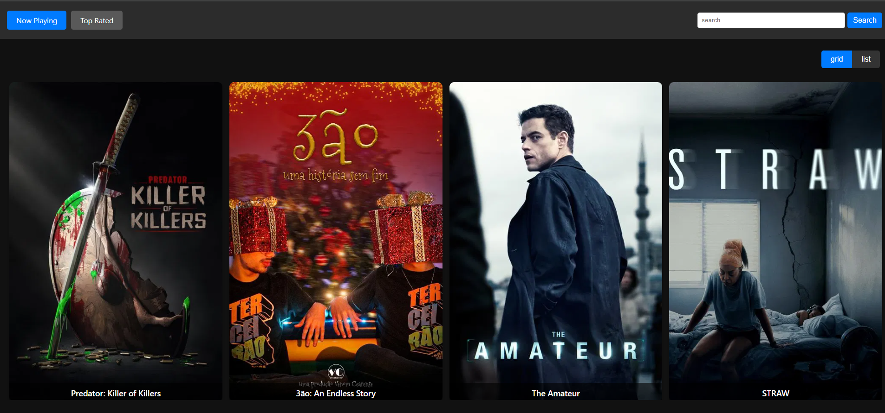

1. Create an account on: https://www.themoviedb.org/

2. For the app to properly run, create an create a .env file with following:

REACT_APP_PUBLIC_BASE_URL=https://api.themoviedb.org/3
POSTER_BASE_URL=https://image.tmdb.org/t/p/w500
API_KEY=YOUR_API_KEY_FROM_MOVIE_DB_ORG

3. # Getting Started with Create React App

This project was bootstrapped with [Create React App](https://github.com/facebook/create-react-app), using the [Redux](https://redux.js.org/) and [Redux Toolkit](https://redux-toolkit.js.org/) TS template.

## Available Scripts

In the project directory, you can run:

### `npm start`

Runs the app in the development mode.\
Open [http://localhost:3000](http://localhost:3000) to view it in the browser.

The page will reload if you make edits.\
You will also see any lint errors in the console.

### `npm run build`

Builds the app for production to the `build` folder.\
It correctly bundles React in production mode and optimizes the build for the best performance.

The build is minified and the filenames include the hashes.\
Your app is ready to be deployed!

# Movie Browser App

A modern web application that allows users to explore "Now Playing" and "Top Rated" movies with a clean, responsive design and smooth user experience.

---

## 📸 Preview

---

## Features

- **Search movies** by title with live filtering.
- **Switch between categories**: Now Playing and Top Rated.
- **Lazy-loaded posters** using blur effect and custom animated skeletons for smooth loading.
- **Grid/List view toggle** for flexible layout preferences.
- **Responsive layout** that looks great on desktop, tablet, and mobile.
- **Graceful error handling and empty state** display.

---

## Tech Stack

- React + TypeScript
- Skeleton loading
- React Router
- react-lazy-load-image-component
- SCSS Modules
- Custom API integration via `MoviesService`
- State management handled using Redux Toolkit

